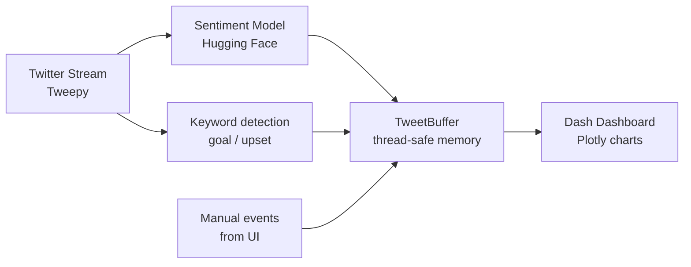

# FootieBuzz — Claude Supply

Complete guide and source code for building a **real-time sentiment analyzer** that tracks live tweets during football matches and visualizes how public opinion shifts after goals and upsets.

**Tech stack:** Python · Tweepy · Hugging Face · Plotly Dash

---

## Table of contents

1. [How it works](#how-it-works)
2. [Architecture diagram](#architecture-diagram)
3. [Project structure](#project-structure)
4. [Quick start](#quick-start)
5. [Dashboard panels](#dashboard-panels)
6. [Key design choices](#key-design-choices)
7. [How sentiment shifts are measured](#how-sentiment-shifts-are-measured)
8. [Customization tips](#customization-tips)
9. [Twitter API notes](#twitter-api-notes)
10. [Environment variables](#environment-variables)
11. [Tips for live matches](#tips-for-live-matches)
12. [Possible next steps](#possible-next-steps)
13. [Full source code](#full-source-code)

---

## How it works

The app runs three things in parallel:

1. **Tweepy** opens a filtered Twitter stream for match hashtags/keywords.
2. Each tweet is scored with **Hugging Face** (`cardiffnlp/twitter-roberta-base-sentiment-latest`) as positive, neutral, or negative.
3. Scored tweets and match events live in a **thread-safe in-memory buffer** shared with the dashboard.
4. **Plotly Dash** refreshes every few seconds with live charts.
5. Goals and upsets are detected from tweet text (`goal`, `upset`, `shock`, etc.) or logged manually from the UI for precise timing.

**Data flow:**

```
Twitter Stream (Tweepy)  →  Sentiment (Hugging Face)  →  In-memory buffer  →  Dash (Plotly)
                                    ↓
                          Auto-detect goal/upset keywords
                                    ↓
                          Manual event logging from UI
```

**Sentiment scoring scale:**

| Label    | Chart value |
|----------|-------------|
| positive | +1          |
| neutral  | 0           |
| negative | -1          |

**Shift detection formula:**

```
delta = after_avg - before_avg
```

A positive delta means crowd mood improved after the event; negative means it soured.

---

## Architecture diagram



---

## Project structure

Create this folder layout inside your repo:

```
footiebuzz/
├── run.py                      # Entry point — starts stream + dashboard
├── requirements.txt
├── .env.example
├── .gitignore
├── config/
│   ├── __init__.py
│   └── settings.py             # Env-based config
├── src/
│   ├── __init__.py
│   ├── twitter/
│   │   ├── __init__.py
│   │   └── stream.py           # Tweepy stream + demo feed
│   ├── analysis/
│   │   ├── __init__.py
│   │   └── sentiment.py        # Hugging Face pipeline
│   ├── storage/
│   │   ├── __init__.py
│   │   └── buffer.py           # Thread-safe tweet/event store
│   └── events/
│       ├── __init__.py
│       └── tracker.py          # Manual goal/upset logging
└── app/
    ├── __init__.py
    └── dashboard.py            # Plotly Dash UI
```

Empty `__init__.py` files can be left blank — they just mark folders as Python packages.

---

## Quick start

### 1. Install dependencies

```powershell
cd c:\Users\Dell\Documents\GitHub\footiebuzz
python -m venv .venv
.venv\Scripts\activate
pip install -r requirements.txt
```

First run downloads the Hugging Face model (~500 MB).

### 2. Configure Twitter (optional)

Copy `.env.example` to `.env` and add your [Twitter API v2 Bearer Token](https://developer.twitter.com/):

```env
TWITTER_BEARER_TOKEN=your_token_here
MATCH_KEYWORDS=WorldCup,ARG,FRA
```

Without a token, the app runs in **demo mode** with simulated tweets.

### 3. Run

```powershell
# Demo mode (no API key)
python run.py --demo

# Live Twitter stream
python run.py --keywords WorldCup Messi

# Custom host/port
python run.py --demo --port 8050
```

Open **http://127.0.0.1:8050**

---

## Dashboard panels

| Panel | What it shows |
|-------|----------------|
| **Sentiment Over Time** | Rolling avg sentiment + tweet volume; vertical lines for goals/upsets |
| **Distribution** | Pie chart of positive / neutral / negative in the window |
| **Before vs After** | Avg sentiment ±2 min around each logged event |
| **Recent Tweets** | Latest scored tweets with color-coded sentiment |
| **Log Event** | Manually mark a goal, upset, or red card (synced to charts) |

---

## Key design choices

### Thread-safe shared buffer

The Twitter stream runs in a background thread. Dash runs on the main thread. `TweetBuffer` uses a `threading.Lock` so both can read/write safely without a database.

### Demo mode

If there is no bearer token (or you pass `--demo`), a background thread injects sample tweets so you can build and test the UI without API access.

### Auto vs manual events

- **Auto:** regex on tweet text catches `goal`, `scored`, `upset`, `shock`, `comeback`, etc.
- **Manual:** use the "Log Event" panel when you see a goal on TV — tweet-based detection often lags 30–60 seconds.

### Hugging Face model

`cardiffnlp/twitter-roberta-base-sentiment-latest` is fine-tuned on tweets, so it handles slang, caps, and emojis better than generic sentiment models.

---

## How sentiment shifts are measured

For each event (auto-detected or logged manually):

1. Collect all tweets in the **2 minutes before** the event timestamp.
2. Collect all tweets in the **2 minutes after** the event timestamp.
3. Convert each tweet label to a score (+1 / 0 / -1).
4. Compute average before and after.
5. `delta = after_avg - before_avg` — shown on the "Before vs After" chart.

Auto-detection keywords:

- **Goals:** `goal`, `goooal`, `scored`, `equalizer`, `penalty`, `own goal`
- **Upsets:** `upset`, `shock`, `stunner`, `comeback`, `underdog`, `miracle`, `unbelievable`

---

## Customization tips

| Goal | What to change |
|------|----------------|
| Track a specific match | `python run.py --keywords ARG FRA WorldCup` |
| Longer match window | `SENTIMENT_WINDOW_MINUTES=90` in `.env` |
| Faster refresh | `DASH_REFRESH_MS=1500` in `.env` |
| Different HF model | `HF_SENTIMENT_MODEL=distilbert-base-uncased-finetuned-sst-2-english` in `.env` |
| High-volume finals | Sample every Nth tweet in `src/twitter/stream.py` |
| More tweet history | `MAX_TWEETS_BUFFER=10000` in `.env` |

---

## Twitter API notes

- You need **Elevated** or higher access for the filtered stream endpoint on Twitter API v2.
- Without a token, `--demo` still exercises the full pipeline end-to-end.
- Rate limits apply on high-volume matches — narrow your keywords if the stream disconnects.
- Get credentials at: https://developer.twitter.com/

---

## Environment variables

| Variable | Default | Description |
|----------|---------|-------------|
| `TWITTER_BEARER_TOKEN` | — | Twitter API v2 bearer token |
| `MATCH_KEYWORDS` | `WorldCup,football` | Comma-separated track terms |
| `HF_SENTIMENT_MODEL` | `cardiffnlp/twitter-roberta-base-sentiment-latest` | Hugging Face model ID |
| `SENTIMENT_WINDOW_MINUTES` | `30` | Chart rolling window |
| `MAX_TWEETS_BUFFER` | `5000` | Max tweets kept in memory |
| `DASH_REFRESH_MS` | `3000` | Dashboard refresh interval (ms) |

---

## Tips for live matches

- Use specific hashtags: team names, `#WorldCup`, match tags (`#ARGFRA`).
- Log goals manually from the UI for precise timing.
- Increase `SENTIMENT_WINDOW_MINUTES` in `.env` for full 90-minute matches.
- For World Cup finals with huge tweet volume, add sampling logic in `stream.py` to avoid overloading the sentiment model.

---

## Possible next steps

- Persist tweets to **SQLite** or **Redis** for post-match analysis
- Split sentiment by **team** (home vs away hashtags)
- Wire in a **live score API** so events auto-sync with real match data
- Add **WebSocket** push instead of polling for lower latency
- Deploy dashboard to **Render** or **Railway** with the stream as a separate worker

---

## Full source code

Copy each file below into your project at the path shown.

---

### `requirements.txt`

```
tweepy>=4.14.0
transformers>=4.40.0
torch>=2.2.0
plotly>=5.22.0
dash>=2.17.0
pandas>=2.2.0
python-dotenv>=1.0.0
dash-bootstrap-components>=1.6.0
```

---

### `.env.example`

```env
# Twitter API v2 credentials (https://developer.twitter.com/)
TWITTER_BEARER_TOKEN=your_bearer_token_here

# Optional: override default sentiment model
# HF_SENTIMENT_MODEL=cardiffnlp/twitter-roberta-base-sentiment-latest

# Comma-separated track rules for the filtered stream (without #)
# MATCH_KEYWORDS=WorldCup,ARGvsFRA,Messi
```

---

### `.gitignore`

```
.env
.venv/
__pycache__/
*.pyc
.pytest_cache/
.DS_Store
```

---

### `config/settings.py`

```python
import os
from pathlib import Path

from dotenv import load_dotenv

load_dotenv(Path(__file__).resolve().parent.parent / ".env")

TWITTER_BEARER_TOKEN = os.getenv("TWITTER_BEARER_TOKEN", "")

HF_SENTIMENT_MODEL = os.getenv(
    "HF_SENTIMENT_MODEL",
    "cardiffnlp/twitter-roberta-base-sentiment-latest",
)

DEFAULT_KEYWORDS = [
    kw.strip()
    for kw in os.getenv("MATCH_KEYWORDS", "WorldCup,football").split(",")
    if kw.strip()
]

# Rolling window for live charts (minutes)
SENTIMENT_WINDOW_MINUTES = int(os.getenv("SENTIMENT_WINDOW_MINUTES", "30"))

# Max tweets kept in memory
MAX_TWEETS_BUFFER = int(os.getenv("MAX_TWEETS_BUFFER", "5000"))

# Dash refresh interval (milliseconds)
DASH_REFRESH_MS = int(os.getenv("DASH_REFRESH_MS", "3000"))
```

---

### `src/storage/buffer.py`

```python
from __future__ import annotations

import threading
from collections import deque
from dataclasses import dataclass, field
from datetime import datetime, timezone
from typing import Deque, Literal

SentimentLabel = Literal["positive", "neutral", "negative"]


@dataclass
class TweetRecord:
    tweet_id: str
    text: str
    author: str
    created_at: datetime
    label: SentimentLabel
    score: float
    keywords_matched: list[str] = field(default_factory=list)


@dataclass
class MatchEvent:
    label: str
    timestamp: datetime
    description: str = ""


class TweetBuffer:
    """Thread-safe in-memory store shared by the stream and Dash app."""

    def __init__(self, max_tweets: int = 5000) -> None:
        self._tweets: Deque[TweetRecord] = deque(maxlen=max_tweets)
        self._events: Deque[MatchEvent] = deque(maxlen=200)
        self._lock = threading.Lock()
        self._total_processed = 0

    def add_tweet(self, record: TweetRecord) -> None:
        with self._lock:
            self._tweets.append(record)
            self._total_processed += 1

    def add_event(self, event: MatchEvent) -> None:
        with self._lock:
            self._events.append(event)

    def tweets_since(self, minutes: int) -> list[TweetRecord]:
        cutoff = datetime.now(timezone.utc).timestamp() - minutes * 60
        with self._lock:
            return [
                t
                for t in self._tweets
                if t.created_at.timestamp() >= cutoff
            ]

    def all_events(self) -> list[MatchEvent]:
        with self._lock:
            return list(self._events)

    @property
    def total_processed(self) -> int:
        with self._lock:
            return self._total_processed

    def recent_tweets(self, limit: int = 20) -> list[TweetRecord]:
        with self._lock:
            return list(self._tweets)[-limit:]

    def sentiment_counts(self, minutes: int) -> dict[str, int]:
        counts = {"positive": 0, "neutral": 0, "negative": 0}
        for tweet in self.tweets_since(minutes):
            counts[tweet.label] += 1
        return counts

    def sentiment_timeline(
        self, minutes: int, bucket_seconds: int = 60
    ) -> list[dict]:
        """Aggregate sentiment into time buckets for line charts."""
        tweets = self.tweets_since(minutes)
        if not tweets:
            return []

        label_to_score = {"positive": 1.0, "neutral": 0.0, "negative": -1.0}
        buckets: dict[int, list[float]] = {}

        for tweet in tweets:
            bucket = int(tweet.created_at.timestamp() // bucket_seconds)
            buckets.setdefault(bucket, []).append(label_to_score[tweet.label])

        timeline = []
        for bucket_ts in sorted(buckets):
            scores = buckets[bucket_ts]
            avg = sum(scores) / len(scores)
            timeline.append(
                {
                    "timestamp": datetime.fromtimestamp(
                        bucket_ts * bucket_seconds, tz=timezone.utc
                    ),
                    "avg_sentiment": round(avg, 3),
                    "volume": len(scores),
                }
            )
        return timeline

    def sentiment_shift_around_events(
        self, minutes: int, window_seconds: int = 120
    ) -> list[dict]:
        """Compare avg sentiment before vs after each logged event."""
        tweets = self.tweets_since(minutes)
        events = self.all_events()
        if not tweets or not events:
            return []

        label_to_score = {"positive": 1.0, "neutral": 0.0, "negative": -1.0}
        shifts = []

        for event in events:
            event_ts = event.timestamp.timestamp()
            before, after = [], []

            for tweet in tweets:
                delta = tweet.created_at.timestamp() - event_ts
                score = label_to_score[tweet.label]
                if -window_seconds <= delta < 0:
                    before.append(score)
                elif 0 <= delta <= window_seconds:
                    after.append(score)

            if before and after:
                before_avg = sum(before) / len(before)
                after_avg = sum(after) / len(after)
                shifts.append(
                    {
                        "event": event.label,
                        "description": event.description,
                        "timestamp": event.timestamp,
                        "before": round(before_avg, 3),
                        "after": round(after_avg, 3),
                        "delta": round(after_avg - before_avg, 3),
                        "tweets_before": len(before),
                        "tweets_after": len(after),
                    }
                )
        return shifts


def _default_buffer() -> TweetBuffer:
    try:
        from config.settings import MAX_TWEETS_BUFFER

        return TweetBuffer(max_tweets=MAX_TWEETS_BUFFER)
    except ImportError:
        return TweetBuffer()


tweet_buffer = _default_buffer()
```

---

### `src/storage/__init__.py`

```python
from .buffer import TweetBuffer, tweet_buffer

__all__ = ["TweetBuffer", "tweet_buffer"]
```

---

### `src/analysis/sentiment.py`

```python
from __future__ import annotations

import logging
import re
from functools import lru_cache

from transformers import pipeline

from config.settings import HF_SENTIMENT_MODEL
from src.storage.buffer import SentimentLabel

logger = logging.getLogger(__name__)

# Map Hugging Face label variants to our three buckets
LABEL_MAP = {
    "positive": "positive",
    "label_2": "positive",
    "pos": "positive",
    "neutral": "neutral",
    "label_1": "neutral",
    "neu": "neutral",
    "negative": "negative",
    "label_0": "negative",
    "neg": "negative",
}

GOAL_PATTERNS = re.compile(
    r"\b(goal{1,2}|gooo+a+l|scored?|equalizer|equaliser|penalty|own goal)\b",
    re.IGNORECASE,
)
UPSET_PATTERNS = re.compile(
    r"\b(upset|shock|stunner|comeback|underdog|miracle|unbelievable)\b",
    re.IGNORECASE,
)


@lru_cache(maxsize=1)
def get_sentiment_pipeline():
    logger.info("Loading sentiment model: %s", HF_SENTIMENT_MODEL)
    return pipeline(
        "sentiment-analysis",
        model=HF_SENTIMENT_MODEL,
        truncation=True,
        max_length=128,
    )


class SentimentAnalyzer:
    def __init__(self) -> None:
        self._pipe = get_sentiment_pipeline()

    def analyze(self, text: str) -> tuple[SentimentLabel, float]:
        cleaned = re.sub(r"http\S+", "", text).strip()
        if not cleaned:
            return "neutral", 0.0

        result = self._pipe(cleaned[:512])[0]
        raw_label = result["label"].lower()
        label: SentimentLabel = LABEL_MAP.get(raw_label, "neutral")
        return label, float(result["score"])

    @staticmethod
    def detect_match_moment(text: str) -> str | None:
        if GOAL_PATTERNS.search(text):
            return "goal"
        if UPSET_PATTERNS.search(text):
            return "upset"
        return None
```

---

### `src/twitter/stream.py`

```python
from __future__ import annotations

import logging
import threading
from datetime import datetime, timezone

import tweepy

from config.settings import DEFAULT_KEYWORDS, TWITTER_BEARER_TOKEN
from src.analysis.sentiment import SentimentAnalyzer
from src.storage.buffer import MatchEvent, TweetRecord, tweet_buffer

logger = logging.getLogger(__name__)


class MatchTweetStream(tweepy.StreamingClient):
    """Filtered Twitter stream that scores tweets and logs match moments."""

    def __init__(self, keywords: list[str] | None = None) -> None:
        if not TWITTER_BEARER_TOKEN:
            raise ValueError(
                "TWITTER_BEARER_TOKEN is missing. Copy .env.example to .env and add your token."
            )

        super().__init__(bearer_token=TWITTER_BEARER_TOKEN, wait_on_rate_limit=True)
        self.keywords = keywords or DEFAULT_KEYWORDS
        self.analyzer = SentimentAnalyzer()
        self._rules_set = False

    def _build_rule(self) -> str:
        # OR together hashtags and plain keywords
        parts = []
        for kw in self.keywords:
            token = kw.lstrip("#")
            parts.append(f"#{token}")
            parts.append(token)
        return " OR ".join(dict.fromkeys(parts))  # dedupe, preserve order

    def setup_rules(self) -> None:
        existing = self.get_rules()
        if existing.data:
            rule_ids = [rule.id for rule in existing.data]
            self.delete_rules(rule_ids)

        rule = self._build_rule()
        self.add_rules(tweepy.StreamRule(value=rule, tag="footiebuzz-match"))
        self._rules_set = True
        logger.info("Stream rule active: %s", rule)

    def on_tweet(self, tweet: tweepy.Tweet) -> None:
        text = tweet.text or ""
        author = tweet.author_id or "unknown"
        created_at = tweet.created_at or datetime.now(timezone.utc)
        if created_at.tzinfo is None:
            created_at = created_at.replace(tzinfo=timezone.utc)

        label, score = self.analyzer.analyze(text)
        matched = [kw for kw in self.keywords if kw.lower() in text.lower()]

        record = TweetRecord(
            tweet_id=str(tweet.id),
            text=text,
            author=str(author),
            created_at=created_at,
            label=label,
            score=score,
            keywords_matched=matched,
        )
        tweet_buffer.add_tweet(record)

        moment = self.analyzer.detect_match_moment(text)
        if moment:
            event_label = "Goal" if moment == "goal" else "Upset"
            tweet_buffer.add_event(
                MatchEvent(
                    label=event_label,
                    timestamp=created_at,
                    description=text[:120],
                )
            )
            logger.info("Detected %s moment from tweet %s", event_label, tweet.id)

    def on_errors(self, errors) -> bool:
        logger.error("Stream errors: %s", errors)
        return True  # keep stream alive

    def on_connection_error(self) -> None:
        logger.warning("Twitter connection error — stream will retry")

    def on_request_error(self, status_code: int) -> bool:
        logger.error("Twitter request error: %s", status_code)
        return status_code != 403

    def start_background(self) -> threading.Thread:
        if not self._rules_set:
            self.setup_rules()

        thread = threading.Thread(target=self.filter, daemon=True)
        thread.start()
        logger.info("Twitter stream started in background thread")
        return thread


def start_demo_feed(keywords: list[str] | None = None) -> threading.Thread:
    """Simulate tweets when you don't have API access yet."""
    import random
    import time

    analyzer = SentimentAnalyzer()
    samples = [
        ("What a goal! Absolutely brilliant finish!", "goal"),
        ("Terrible defending, we deserve to lose.", None),
        ("This is the biggest upset of the tournament!", "upset"),
        ("Neutral possession, nothing happening.", None),
        ("GOOOAL!!! The crowd goes wild!", "goal"),
        ("Shocking performance from the favorites.", "upset"),
        ("Best match of the World Cup so far!", None),
        ("Penalty!!! No way that was a foul.", "goal"),
        ("Comeback of the century, unbelievable!", "upset"),
    ]

    def _run() -> None:
        kws = keywords or DEFAULT_KEYWORDS
        while True:
            text, moment = random.choice(samples)
            now = datetime.now(timezone.utc)
            label, score = analyzer.analyze(text)

            tweet_buffer.add_tweet(
                TweetRecord(
                    tweet_id=str(time.time_ns()),
                    text=text,
                    author="demo_user",
                    created_at=now,
                    label=label,
                    score=score,
                    keywords_matched=kws[:1],
                )
            )

            if moment:
                tweet_buffer.add_event(
                    MatchEvent(
                        label="Goal" if moment == "goal" else "Upset",
                        timestamp=now,
                        description=text,
                    )
                )

            time.sleep(random.uniform(1.5, 4.0))

    thread = threading.Thread(target=_run, daemon=True)
    thread.start()
    logger.info("Demo tweet feed started (no Twitter API required)")
    return thread
```

---

### `src/events/tracker.py`

```python
from __future__ import annotations

from datetime import datetime, timezone

from src.storage.buffer import MatchEvent, tweet_buffer


def log_manual_event(label: str, description: str = "") -> MatchEvent:
    """Log a goal, upset, or custom moment from the dashboard."""
    event = MatchEvent(
        label=label.strip() or "Event",
        timestamp=datetime.now(timezone.utc),
        description=description.strip(),
    )
    tweet_buffer.add_event(event)
    return event
```

---

### `app/dashboard.py`

```python
from __future__ import annotations

import dash_bootstrap_components as dbc
import pandas as pd
import plotly.graph_objects as go
from dash import Dash, Input, Output, State, dash_table, dcc, html
from plotly.subplots import make_subplots

from config.settings import DASH_REFRESH_MS, SENTIMENT_WINDOW_MINUTES
from src.events.tracker import log_manual_event
from src.storage.buffer import tweet_buffer


def _empty_figure(title: str) -> go.Figure:
    fig = go.Figure()
    fig.update_layout(
        title=title,
        template="plotly_dark",
        paper_bgcolor="#0f1117",
        plot_bgcolor="#0f1117",
        font=dict(color="#e8e8e8"),
        xaxis=dict(visible=False),
        yaxis=dict(visible=False),
        annotations=[
            dict(
                text="Waiting for tweets…",
                xref="paper",
                yref="paper",
                x=0.5,
                y=0.5,
                showarrow=False,
                font=dict(size=16, color="#888"),
            )
        ],
    )
    return fig


def build_sentiment_timeline_figure(minutes: int) -> go.Figure:
    timeline = tweet_buffer.sentiment_timeline(minutes)
    events = tweet_buffer.all_events()

    if not timeline:
        return _empty_figure("Sentiment Over Time")

    df = pd.DataFrame(timeline)

    fig = make_subplots(specs=[[{"secondary_y": True}]])
    fig.add_trace(
        go.Scatter(
            x=df["timestamp"],
            y=df["avg_sentiment"],
            mode="lines+markers",
            name="Avg sentiment",
            line=dict(color="#00d4aa", width=2),
            fill="tozeroy",
            fillcolor="rgba(0, 212, 170, 0.15)",
        ),
        secondary_y=False,
    )
    fig.add_trace(
        go.Bar(
            x=df["timestamp"],
            y=df["volume"],
            name="Tweet volume",
            marker_color="rgba(99, 110, 250, 0.45)",
            opacity=0.7,
        ),
        secondary_y=True,
    )

    for event in events:
        color = "#ff6b6b" if event.label.lower() == "goal" else "#ffd93d"
        fig.add_vline(
            x=event.timestamp,
            line_width=1,
            line_dash="dash",
            line_color=color,
        )
        fig.add_annotation(
            x=event.timestamp,
            y=1,
            yref="paper",
            text=event.label,
            showarrow=False,
            font=dict(size=10, color=color),
            bgcolor="rgba(0,0,0,0.6)",
        )

    fig.update_layout(
        title="Sentiment Over Time",
        template="plotly_dark",
        paper_bgcolor="#0f1117",
        plot_bgcolor="#0f1117",
        font=dict(color="#e8e8e8"),
        legend=dict(orientation="h", y=1.12),
        margin=dict(t=60, b=40),
        hovermode="x unified",
    )
    fig.update_yaxes(
        title_text="Sentiment (-1 neg → +1 pos)",
        range=[-1.05, 1.05],
        secondary_y=False,
    )
    fig.update_yaxes(title_text="Tweets / min", secondary_y=True)
    return fig


def build_distribution_figure(minutes: int) -> go.Figure:
    counts = tweet_buffer.sentiment_counts(minutes)
    if sum(counts.values()) == 0:
        return _empty_figure("Sentiment Distribution")

    colors = {"positive": "#00d4aa", "neutral": "#6c7a89", "negative": "#ff6b6b"}
    labels = list(counts.keys())
    values = [counts[k] for k in labels]

    fig = go.Figure(
        go.Pie(
            labels=labels,
            values=values,
            hole=0.45,
            marker=dict(colors=[colors[l] for l in labels]),
            textinfo="label+percent",
        )
    )
    fig.update_layout(
        title="Sentiment Distribution",
        template="plotly_dark",
        paper_bgcolor="#0f1117",
        plot_bgcolor="#0f1117",
        font=dict(color="#e8e8e8"),
        margin=dict(t=60, b=20),
    )
    return fig


def build_shift_figure(minutes: int) -> go.Figure:
    shifts = tweet_buffer.sentiment_shift_around_events(minutes)
    if not shifts:
        return _empty_figure("Sentiment Shift Around Events")

    df = pd.DataFrame(shifts)
    x_labels = [
        f"{row['event']}<br>{row['timestamp'].strftime('%H:%M')}"
        for _, row in df.iterrows()
    ]

    fig = go.Figure()
    fig.add_trace(
        go.Bar(
            name="Before",
            x=x_labels,
            y=df["before"],
            marker_color="#6c7a89",
        )
    )
    fig.add_trace(
        go.Bar(
            name="After",
            x=x_labels,
            y=df["after"],
            marker_color="#00d4aa",
        )
    )
    fig.add_trace(
        go.Scatter(
            name="Delta",
            x=x_labels,
            y=df["delta"],
            mode="markers+text",
            text=[f"{d:+.2f}" for d in df["delta"]],
            textposition="top center",
            marker=dict(color="#ffd93d", size=12),
        )
    )
    fig.update_layout(
        title="Sentiment Before vs After Goals / Upsets (±2 min)",
        template="plotly_dark",
        barmode="group",
        paper_bgcolor="#0f1117",
        plot_bgcolor="#0f1117",
        font=dict(color="#e8e8e8"),
        yaxis=dict(title="Avg sentiment", range=[-1.05, 1.05]),
        margin=dict(t=60, b=40),
        legend=dict(orientation="h", y=1.12),
    )
    return fig


def create_app() -> Dash:
    app = Dash(
        __name__,
        external_stylesheets=[dbc.themes.CYBORG],
        title="FootieBuzz — Live Sentiment",
        suppress_callback_exceptions=True,
    )

    app.layout = dbc.Container(
        [
            dbc.Row(
                dbc.Col(
                    html.Div(
                        [
                            html.H1("FootieBuzz", className="mb-0"),
                            html.P(
                                "Real-time match sentiment from live tweets",
                                className="text-muted",
                            ),
                        ]
                    ),
                    width=8,
                ),
                dbc.Col(
                    html.Div(id="stats-bar", className="text-end pt-2"),
                    width=4,
                ),
            ),
            html.Hr(),
            dbc.Row(
                [
                    dbc.Col(
                        dcc.Graph(id="timeline-chart", config={"displayModeBar": False}),
                        md=8,
                    ),
                    dbc.Col(
                        dcc.Graph(
                            id="distribution-chart", config={"displayModeBar": False}
                        ),
                        md=4,
                    ),
                ],
                className="mb-3",
            ),
            dbc.Row(
                dbc.Col(
                    dcc.Graph(id="shift-chart", config={"displayModeBar": False}),
                    width=12,
                ),
                className="mb-3",
            ),
            dbc.Row(
                [
                    dbc.Col(
                        [
                            html.H5("Log a match moment"),
                            dbc.InputGroup(
                                [
                                    dbc.Select(
                                        id="event-type",
                                        options=[
                                            {"label": "Goal", "value": "Goal"},
                                            {"label": "Upset", "value": "Upset"},
                                            {"label": "Red Card", "value": "Red Card"},
                                            {"label": "Custom", "value": "Custom"},
                                        ],
                                        value="Goal",
                                    ),
                                    dbc.Input(
                                        id="event-description",
                                        placeholder="e.g. Messi 78' — Argentina 2-1",
                                    ),
                                    dbc.Button(
                                        "Add Event",
                                        id="add-event-btn",
                                        color="success",
                                    ),
                                ],
                                className="mb-2",
                            ),
                            html.Div(id="event-feedback", className="text-success small"),
                        ],
                        md=5,
                    ),
                    dbc.Col(
                        [
                            html.H5("Recent tweets"),
                            dash_table.DataTable(
                                id="recent-tweets-table",
                                columns=[
                                    {"name": "Time", "id": "time"},
                                    {"name": "Sentiment", "id": "sentiment"},
                                    {"name": "Tweet", "id": "text"},
                                ],
                                style_table={"overflowX": "auto"},
                                style_header={
                                    "backgroundColor": "#1a1d27",
                                    "color": "#e8e8e8",
                                    "fontWeight": "bold",
                                },
                                style_cell={
                                    "backgroundColor": "#0f1117",
                                    "color": "#ccc",
                                    "maxWidth": "400px",
                                    "overflow": "hidden",
                                    "textOverflow": "ellipsis",
                                },
                                style_data_conditional=[
                                    {
                                        "if": {
                                            "filter_query": '{sentiment} = "positive"',
                                        },
                                        "color": "#00d4aa",
                                    },
                                    {
                                        "if": {
                                            "filter_query": '{sentiment} = "negative"',
                                        },
                                        "color": "#ff6b6b",
                                    },
                                ],
                                page_size=8,
                            ),
                        ],
                        md=7,
                    ),
                ]
            ),
            dcc.Interval(id="refresh-interval", interval=DASH_REFRESH_MS, n_intervals=0),
        ],
        fluid=True,
        className="py-3",
        style={"backgroundColor": "#0a0b0f", "minHeight": "100vh"},
    )

    @app.callback(
        Output("timeline-chart", "figure"),
        Output("distribution-chart", "figure"),
        Output("shift-chart", "figure"),
        Output("recent-tweets-table", "data"),
        Output("stats-bar", "children"),
        Input("refresh-interval", "n_intervals"),
    )
    def refresh_dashboard(_n: int):
        minutes = SENTIMENT_WINDOW_MINUTES
        timeline_fig = build_sentiment_timeline_figure(minutes)
        dist_fig = build_distribution_figure(minutes)
        shift_fig = build_shift_figure(minutes)

        rows = []
        for tweet in reversed(tweet_buffer.recent_tweets(8)):
            rows.append(
                {
                    "time": tweet.created_at.strftime("%H:%M:%S"),
                    "sentiment": tweet.label,
                    "text": tweet.text[:140],
                }
            )

        counts = tweet_buffer.sentiment_counts(minutes)
        total = sum(counts.values())
        stats = html.Div(
            [
                html.Span(f"Tweets analyzed: {tweet_buffer.total_processed}", className="me-3"),
                html.Span(f"Window: {total} tweets", className="me-3"),
                html.Span(
                    f"+{counts['positive']} / "
                    f"={counts['neutral']} / "
                    f"-{counts['negative']}",
                ),
            ]
        )
        return timeline_fig, dist_fig, shift_fig, rows, stats

    @app.callback(
        Output("event-feedback", "children"),
        Input("add-event-btn", "n_clicks"),
        State("event-type", "value"),
        State("event-description", "value"),
        prevent_initial_call=True,
    )
    def add_event(n_clicks, event_type, description):
        if not n_clicks:
            return ""
        event = log_manual_event(event_type or "Event", description or "")
        return f"Logged {event.label} at {event.timestamp.strftime('%H:%M:%S')}"

    return app
```

---

### `run.py`

```python
#!/usr/bin/env python3
"""FootieBuzz entry point — start the tweet stream and Dash dashboard."""

from __future__ import annotations

import argparse
import logging
import sys
from pathlib import Path

# Ensure project root is on sys.path when run as `python run.py`
ROOT = Path(__file__).resolve().parent
if str(ROOT) not in sys.path:
    sys.path.insert(0, str(ROOT))

from app.dashboard import create_app
from config.settings import DEFAULT_KEYWORDS, TWITTER_BEARER_TOKEN
from src.twitter.stream import MatchTweetStream, start_demo_feed

logging.basicConfig(
    level=logging.INFO,
    format="%(asctime)s [%(levelname)s] %(name)s: %(message)s",
)
logger = logging.getLogger("footiebuzz")


def parse_args() -> argparse.Namespace:
    parser = argparse.ArgumentParser(description="FootieBuzz live sentiment analyzer")
    parser.add_argument(
        "--demo",
        action="store_true",
        help="Use simulated tweets (no Twitter API required)",
    )
    parser.add_argument(
        "--keywords",
        nargs="+",
        default=None,
        help="Hashtags/keywords to track (default: from .env or WorldCup,football)",
    )
    parser.add_argument(
        "--host",
        default="127.0.0.1",
        help="Dash host (default: 127.0.0.1)",
    )
    parser.add_argument(
        "--port",
        type=int,
        default=8050,
        help="Dash port (default: 8050)",
    )
    parser.add_argument(
        "--debug",
        action="store_true",
        help="Run Dash in debug mode",
    )
    return parser.parse_args()


def main() -> None:
    args = parse_args()
    keywords = args.keywords or DEFAULT_KEYWORDS

    if args.demo or not TWITTER_BEARER_TOKEN:
        if not args.demo and not TWITTER_BEARER_TOKEN:
            logger.warning(
                "No TWITTER_BEARER_TOKEN found — falling back to demo mode. "
                "Copy .env.example to .env and add your token for live tweets."
            )
        start_demo_feed(keywords)
    else:
        stream = MatchTweetStream(keywords=keywords)
        stream.start_background()

    app = create_app()
    logger.info("Dashboard → http://%s:%s", args.host, args.port)
    app.run(host=args.host, port=args.port, debug=args.debug)


if __name__ == "__main__":
    main()
```

---

## License

MIT
